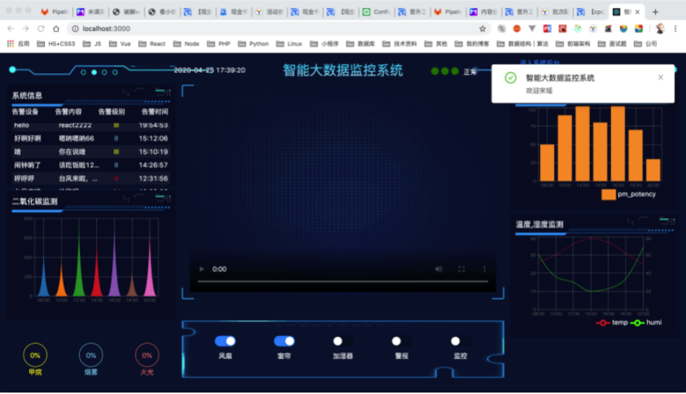
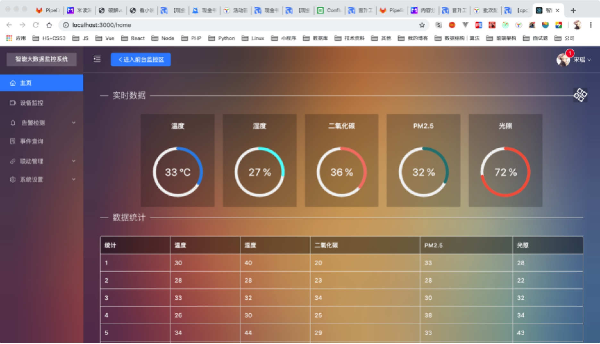
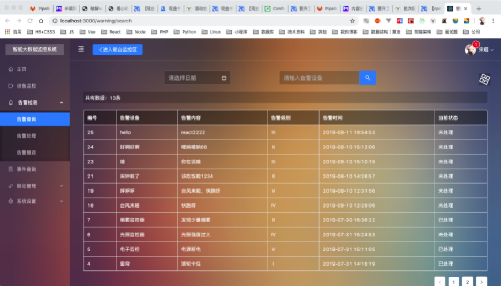
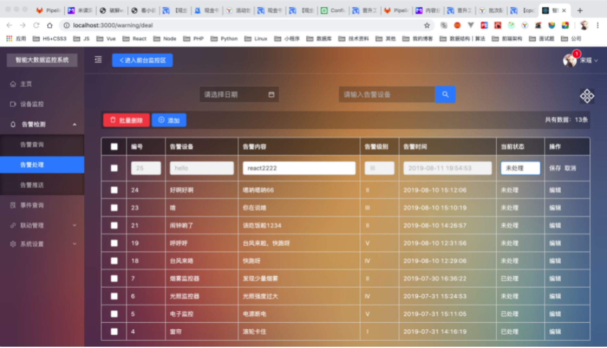
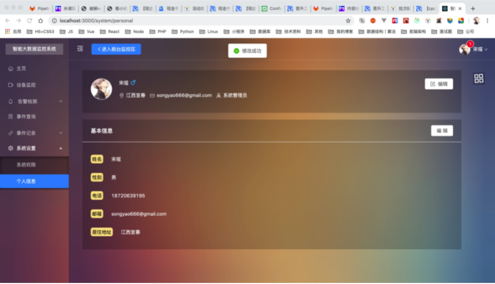
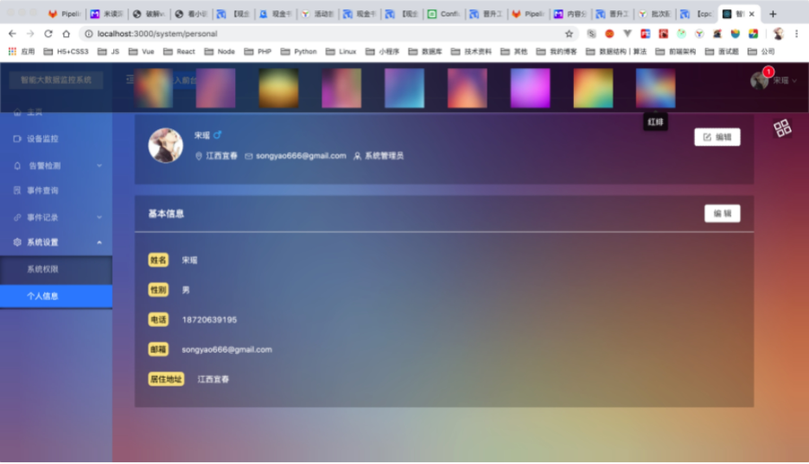

# 智能温室监控系统的设计与实现（毕业设计-2020-宋瑶）
- 设计方案
  
     - 系统：MacOS
     - 开发工具：VSCode
     - 技术要求：React、React-router、Redux、antd、Redux-thunk、Axios、ThinkPHP、MySql
     - 设计步骤：分析需求，规划模块，页面设计，后台实现，前后台对接，测试
     - 设计成果：完成基于React全家桶的智能数据监控系统的设计与实现，完成毕业论文
     
- 研究方法（手段）
  
     - 1.资料查找法：查阅植物研究学资料了解影响植物生长的环境因素，如二氧化碳，光照，温度，湿度等。
     - 2.研究项目分析法：在进行理论的搜集与分析之后，根据现有的研究项目整体系统进行分析与设计，实现理论与实践的相结合，使理论有理有据，设计更合理。
     - 3.调查法：调查国内外智能温室大棚技术的发展现状，制定出适应国内现状的智能温室研究方案。
     - 4.比较分析法：将传统农业与现代智能农业做比较，吸取传统农业优点避开传统农业缺点，让现代智能农业能够更好的发展。
     - 5.理论联系实际法：将资料中的理论知识，结合国内智能农业发展的现状，提出相应地应对策略。
     
- 功能需求

  - （1）系统登录，系统人员管理模块
        本系统需求使用账号密码登录之后方可进入，管理员账号登入之后可为系统添加其他用户，普通用户不具有该功能，管理员账号还可以删除系统的任意用户信息，也就是说管理员账号具有该系统的最高权限，普通用户的权限都由管理员来分配。
  - （2）前台监控模块
        调用设备摄像头模拟监控大棚内的植物生长状态，通过媒体流技术将画面传输至前台页面的中央可视区，用户能够在任意时刻都可以非常清晰的观察到的植物的生长状态，保证用户在第一时间内了解大棚内的植物情况，视频画面都是实时监控的，在需要的时候用户可以到后台查询任何一天内的植物生长的视频监控，后台默认保留一个月内的植物视频监控。
  - （3）前台告警模块
    在前台可视化页面的左上角是一个滚动的信息推送区域，该区域会将系统监测到的大棚内存在的问题展示出来，以便用户能够清晰的了解大棚内的植物与环境状态。当情况达到一定指标时，系统前台页面会发出报警，指示灯变成红色，通知用户当前的情况可能比较糟糕需要及时处理。
  - （4）前台数据可视化模块
        在前台页面的四周是一些大棚内的环境因素的数据表格，比如：二氧化碳，光照，温度，湿度等，系统通过一些可视化图形展示这些重要数据，可以让用户非常清晰的了解当前大棚内的环境如何。
  - （5）前台硬件模拟操作模块
    在前台页面的正下方有五个开关，用来模拟控制硬件调节大棚内的环境或发出警报，风扇开关用来调节大棚内的温度，窗帘开关用来调节大棚内的光照强度，加湿器开关用来调节大棚内的湿度，警报开关用来向现场作业人员发出警报，监控开关用来控制大棚内监控的开与闭。
  - （6）后台数据处理模块
    前台页面右上角又一个进入后台的页面入口，后台可以查询系统的所有的相关数据，以及对相应数据作出修改，后台主页是几个仪表盘用来展示大棚的环境变化，告警查询可以通过告警内容或告警时间来查找，告警内容的处理，管理员可以修改或删除告警信息，以及查看告警内容的当前的状态是已处理还是未处理，如果未处理通知相应人员及时处理，告警推送，管理员能够向前台推送相应地信息。
  - （7）系统设置模块
    后台系统皮肤设置，这里一共提供了9种颜色供用户选择，分别是：海老茶，紫甘，路考茶，浅苏紫等，用户可以选择自己喜爱的主题颜色。人员信息查看，可以查看自己的身份信息以及修改身份信息。

  #### 预览图

    

